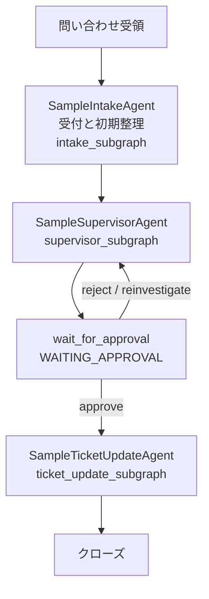
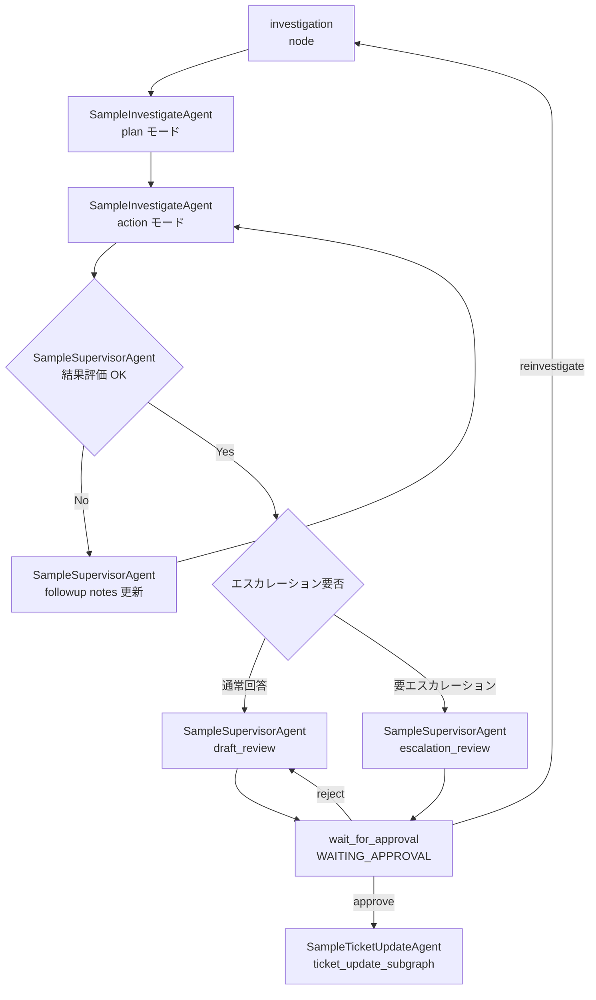

# support-ope-agents

Deep Agents と LangGraph を組み合わせて、カスタマーサポート業務をオーケストレーションする PoC 実装です。

## コンセプト

- 従来は人手の判断、探索、整形に依存してシステム化されなかった業務を、生成AIを用いて説明可能かつ制御可能な業務システムへ変換することを目指す。
- 適用対象としてカスタマーサポート業務を題材に、問い合わせ受付、調査、回答起案、承認、チケット更新までを生成AIで支援する PoC を具体化する。

### システム化されなかった要因

従来の IT システムでは対応できず、人手に頼らざるを得なかった背景として、次の「4つの壁」があります。

- 技術の壁: 従来のシステムは構造化データしか扱いにくく、フォーマットがばらばらな情報を扱うには人間が「翻訳機」になる必要があった
- 投資の壁: 複雑な条件分岐や例外処理が多い業務を従来型プログラミングでシステム化しようとすると、開発・保守コストが膨大になり投資対効果が合わなかった
- 統制の壁: 最終的な Go/No-Go 判断や誤ったときのリスクが大きく、ルールベースの機械に全権を委譲できなかった
- 暗黙知の壁: マニュアル化できる手順よりも、ベテラン社員の勘、経験、背景理解に強く依存しており、要件定義自体が難しかった

このプロジェクトは、こうした「人手でしか回らなかった業務」を、生成AIとワークフロー制御、ツール連携、レビューと承認を組み合わせることで、説明可能で制御可能な形に変換できるかを検証するものです。

### カスタマーサポート業務のシナリオ

適用例として取り上げるのは、複雑なログ調査や過去事例の紐解きを伴うテクニカルサポート業務です。

トリガーとなる事象は次のようなものです。

> 顧客から、「データ仮想化サーバーのプロセスが突然停止した。再起動で現在は復旧しているが、再発防止のために原因を調査してほしい。事象発生時のサーバーログ（大容量）を添付する」という問い合わせとログファイルが Zendesk に起票された。

従来の As-Is では、CS 管理者によるアサイン、担当者による Redmine 起票、大容量ログの目視確認、Growi などでの過去事例検索、顧客回答文の手作成までを人手で行うため、ベテランの勘と膨大な時間に依存していました。

この PoC の To-Be では、初動整理から回答案作成、評価までを一貫支援する流れを想定しています。

1. 受付と初期整理
2. 調査方針の決定
3. 専門エージェントによる調査
4. 回答案またはエスカレーション案の作成
5. レビューと承認
6. 事後評価

つまり、このプロジェクトは「問い合わせを受けてから、調査し、回答し、必要ならエスカレーションし、最後に評価するまで」のカスタマーサポート業務全体を、生成AIエージェント群でどこまで支援できるかを検証する PoC です。

## 実装イメージ

- 業務プロセス全体は LangGraph のワークフローで制御する
- スーパーバイザーおよびサブエージェントは各々 DeepAgentまたはLangGraphのサブグラフとして実装する
- エージェント間の情報共有と進捗共有は、ケース単位の共有メモリファイルで行う
- ObjectiveEvaluator が客観基準で評価するレポートを生成
- 各エージェントは役割別ツールを持ち、コンテキスト逼迫時は圧縮済みサマリへ退避する
- 指示ファイルを差し替えることで、業務手順の細部を後から拡張できる
- CLI に加えて API と MCP を追加できる構成を前提にする
- ケースごとに workspace を登録でき、artifact と evidence を分離管理する
- I/F(API/MCP/CLI) -> Runtime -> Workflow -> 各種エージェント -> ツールという構造を持ち、それぞれ以下の役割を持つ
  - I/F: CLI、API、MCP などの入口としてケース入力と結果出力を受け持つ
  - Runtime: 設定に応じて sample / production の実行環境を組み立て、ケース単位の状態管理、実行継続、constraint_mode に基づくランタイム制約の解決を担う
  - Workflow: LangGraph で全体の状態遷移を制御し、どのエージェントをどの順序で動かすかを決める
  - 各種エージェント: IntakeAgent や SuperVisorAgent などが、受付、調査、起案、承認、更新、評価といった業務上の役割ごとに処理を実行する
  - ツール: エージェントが利用する個別機能群として、ファイル操作や外部連携を提供する

## ワークフローとエージェント

sample runtime の main workflow は、receive_case -> intake_subgraph -> supervisor_subgraph という骨格で動きます。実際に役割を持つ実行主体は主に SampleIntakeAgent、SampleSupervisorAgent、SampleInvestigateAgent、SampleTicketUpdateAgent であり、承認待ちや review は独立 agent ではなく workflow node として扱われます。

まず、main workflow 全体は次のとおりです。



SampleSupervisorAgent の内部ワークフローは次のとおりです。



現在の sample 系で中心となるエージェントは次のとおりです。

- SampleIntakeAgent: 問い合わせ受付時の定型前処理を担当する。入力問い合わせを正規化し、問い合わせ分類や不足情報を整理して、後続フェーズへ渡す。
- SampleSupervisorAgent: sample workflow 全体の進行管理を担う親エージェントである。investigation node の中で SampleInvestigateAgent を plan モードと action モードで呼び出し、結果を見て draft_review へ進むか escalation_review へ進むかを判断する。
- SampleInvestigateAgent: sample 版の中核となる調査エージェントである。仕様確認、ログ解析、ナレッジ探索、回答ドラフト作成を一体で担い、問い合わせ種別に応じて必要な証跡確認と文書探索を行い、その結果を investigation_summary と draft_response にまとめる。
- SampleTicketUpdateAgent: 承認後に外部チケット更新内容を確定し、外部チケット反映を段階的に進める sample 版の更新エージェントである。sample workflow では ticket_update_subgraph の実行主体として使われる。

ObjectiveEvaluator は sample main workflow の独立 node ではありません。SampleSupervisorAgent の investigation フェーズ内で action 結果の採点に使われ、あわせて改善レポート生成でも利用されます。

承認は独立した sample agent ではなく、SampleSupervisorAgent 配下の workflow 停止ノードとして扱います。WAITING_APPROVAL で人間の判断を受け付け、承認、差戻し、再調査のいずれかに応じて後続フェーズへ戻します。

sample の escalation_review も独立 agent ではなく、SampleSupervisorAgent 内の review ノードとして扱います。エスカレーション要約と問い合わせ文案の整理は Supervisor 配下で完結します。

workflow 上の主な接続イメージは次のとおりです。

1. SampleIntakeAgent が問い合わせを受け付け、入力を整える
2. SampleSupervisorAgent の investigation node が調査方針を決め、まず SampleInvestigateAgent を plan モードで呼び出す
3. 同じ investigation node の中で、SampleInvestigateAgent が action モードで調査と回答ドラフト作成を進める
4. SampleSupervisorAgent が action 結果を評価し、必要なら followup notes を更新して SampleInvestigateAgent を再実行する
5. 結果が十分なら、SampleSupervisorAgent が通常回答の draft_review へ進めるか、escalation_review へ進めるかを決める
6. SampleSupervisorAgent 配下の承認ノードが人間の承認、差戻し、再調査要求を受け付ける
7. SampleTicketUpdateAgent が承認済み内容を外部チケットへ反映する
8. ObjectiveEvaluator は investigation の採点と改善レポート生成で補助的に利用される

action モードのループは、SampleSupervisorAgent の investigation フェーズ内で実行されます。現行 sample 実装では、plan モードで調査計画を作成したあと、action モードの結果を ObjectiveEvaluator で採点し、基準点未満かつ followup 上限未到達であれば、Supervisor が followup notes を更新して SampleInvestigateAgent を再実行します。

## 初期構成

- [docs/quickstart.md](docs/quickstart.md): 起動手順と最初の実行フロー
- [docs/customer-support-deepagents-design.md](docs/customer-support-deepagents-design.md): 実装設計書
- [docs/configuration.md](docs/configuration.md): 設定ガイド
- [config.yml](config.yml): 非秘匿設定
- [.env.example](.env.example): 秘匿設定テンプレート
- [src/support_ope_agents](src/support_ope_agents): アプリ本体
- [src/support_ope_agents/interfaces](src/support_ope_agents/interfaces): API/MCP インターフェース層
- [src/support_ope_agents/instructions/defaults](src/support_ope_agents/instructions/defaults): 共通指示と役割別指示の内蔵デフォルト
- [.instructions](.instructions): 必要に応じて既定指示を上書きするための任意 override ディレクトリ

## runtime mode の考え方

このリポジトリには `sample` 系と `production` 系の 2 系統の runtime 実装があります。どちらを使うかは [config.yml](config.yml) の `support_ope_agents.runtime.mode` で切り替えます。

現時点では `sample` 系を最新の参照実装として扱い、README のワークフローとエージェント説明も原則として sample runtime を基準に記載しています。

責務の境界としては、Runtime が executor の組み立て、checkpointer やケース状態管理、instruction と runtime 制約の適用方針解決を担い、Workflow は LangGraph 上の状態遷移とノード接続を担います。ランタイム制約そのものの解決は Workflow ではなく Runtime 側で行います。

```yaml
support_ope_agents:
	runtime:
		mode: production
```

`sample` 系は、汎用的な作り込みを主目的にせず、コンセプト確認と UI / フローのテストを素早く回すための簡素な実装です。PoC の流れを短く確認したい場合、画面やケース進行のたたき台を試したい場合、個別の制約や例外処理をまだ詰め切っていない段階で全体像を確認したい場合に向いています。サンプル環境の起動例や前提条件は [samples/support-ope-agents/README.md](samples/support-ope-agents/README.md) を参照してください。

`production` 系は、通常運用を見据えて、より多くの状況を想定した例外処理、制約、状態遷移、外部連携を含めるための実装です。`sample` で確認したコンセプトをそのまま終わらせず、実際の業務ワークフローに近い条件へ具体化していくことを目的にしています。既定の [config.yml](config.yml) はこちらを前提にしており、CLI / API / MCP の説明も原則として production runtime を基準にしています。

使い分けの目安は次のとおりです。

- まず画面や基本フローを早く確認したい場合は `sample`
- 例外処理、承認、再開、チェックポイント、レポート生成まで含めて挙動を詰めたい場合は `production`
- 実運用に近い設定やテストを増やしていく場合は `production` を基準にし、`sample` は概念実証や比較対象として扱う

README 中の通常の起動例は `production` 前提です。`sample` を使う場合は [samples/support-ope-agents/config-sample.yml](samples/support-ope-agents/config-sample.yml) のように `runtime.mode: sample` を持つ設定ファイルを指定して起動します。

## 起動

通常の起動手順、CLI の実行例、API と frontend の立ち上げ、MCP 連携、document_sources や tools.logical_tools の設定例は [docs/quickstart.md](docs/quickstart.md) に分離しました。README では概要だけを扱い、実際に動かす手順はクイックスタートを参照してください。

production runtime を前提に最初に動かす場合は [docs/quickstart.md](docs/quickstart.md) を参照してください。sample runtime を使う場合は [samples/support-ope-agents/README.md](samples/support-ope-agents/README.md) と [samples/support-ope-agents/config-sample.yml](samples/support-ope-agents/config-sample.yml) を参照してください。

## workflow ルーティング対象

現在の workflow ルーティング対象は次の 3 系統です。

- 仕様調査ワークフロー
- 障害調査ワークフロー
- 判定困難ワークフロー

## 今後の実装対象

- DeepAgent の task ツール経由でのサブエージェント起動
- Approval interrupt の再開 UX 改善
- Zendesk / Redmine / ナレッジベース接続
- ガバナンス層とトレース基盤の接続