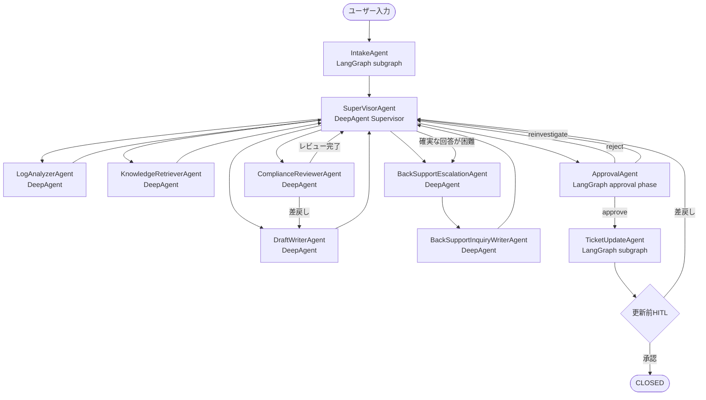

# カスタマーサポート Deep Agents 実装設計書

## 1. 目的

本設計書は、カスタマーサポート業務シナリオを support-ope-agents 上で実装するための初期設計を定義する。
対象業務は、問い合わせ受付、ログ解析、ナレッジ探索、回答ドラフト生成、人間承認、チケット更新である。

agent 個別の詳細仕様は次を参照する。

- 共通事項: [docs/agents/common.md](/home/user/source/repos/support-ope-agents/docs/agents/common.md)
- SuperVisorAgent: [docs/agents/supervisor-agent.md](/home/user/source/repos/support-ope-agents/docs/agents/supervisor-agent.md)
- IntakeAgent: [docs/agents/intake-agent.md](/home/user/source/repos/support-ope-agents/docs/agents/intake-agent.md)
- LogAnalyzerAgent: [docs/agents/log-analyzer-agent.md](/home/user/source/repos/support-ope-agents/docs/agents/log-analyzer-agent.md)
- KnowledgeRetrieverAgent: [docs/agents/knowledge-retriever-agent.md](/home/user/source/repos/support-ope-agents/docs/agents/knowledge-retriever-agent.md)
- DraftWriterAgent: [docs/agents/draft-writer-agent.md](/home/user/source/repos/support-ope-agents/docs/agents/draft-writer-agent.md)
- ComplianceReviewerAgent: [docs/agents/compliance-reviewer-agent.md](/home/user/source/repos/support-ope-agents/docs/agents/compliance-reviewer-agent.md)
- BackSupportEscalationAgent: [docs/agents/back-support-escalation-agent.md](/home/user/source/repos/support-ope-agents/docs/agents/back-support-escalation-agent.md)
- BackSupportInquiryWriterAgent: [docs/agents/back-support-inquiry-writer-agent.md](/home/user/source/repos/support-ope-agents/docs/agents/back-support-inquiry-writer-agent.md)
- ApprovalAgent: [docs/agents/approval-agent.md](/home/user/source/repos/support-ope-agents/docs/agents/approval-agent.md)
- TicketUpdateAgent: [docs/agents/ticket-update-agent.md](/home/user/source/repos/support-ope-agents/docs/agents/ticket-update-agent.md)

tool 個別の詳細仕様は次を参照する。

- ツール設計書 index: [docs/tools/README.md](/home/user/source/repos/support-ope-agents/docs/tools/README.md)

本アプリの実装コンセプトは次の通りとする。

- 業務プロセスは LangGraph のワークフローで表現する
- スーパーバイザーおよび調査・解決系サブエージェントは DeepAgent で実装する
- 定型的な前処理フェーズは LangGraph のノードまたは subgraph として実装する
- 定型的で手順が明確な処理は LangGraph Subgraph として実装し、ワークフロー上では疑似的なエージェントとして扱う
- 探索的で試行錯誤や文脈圧縮が必要な処理は DeepAgent として実装する
- エージェント間の情報共有と進捗共有は共通メモリファイルで行う
- 各エージェントはコンテキスト管理機能を持ち、閾値超過時には圧縮処理を実施する
- 各エージェントは役割に応じたツールを持つ
- 業務プロセスはワークフローに従うが、細部は指示ファイルで追加指示を出せる
- 各エージェントのツールは後から追加可能な構成とする
- ユーザーからの入力インタフェースはCLI、API、MCPのいずれかとする。
- 各種ログファイルや画像エビデンスなどの格納用のワークスペースディレクトリの指定が可能。　　
　各エージェントはワークスペースの情報も参考にしてタスクを実行する。
- 実行時生成物はプロジェクト直下の work ディレクトリに出力し、Git 管理対象から除外する。
- configファイルには、アプリケーション共通設定項目の他、各エージェント用の設定カテゴリを持つ。
- 実装はできるだけ共通化する。またレイヤー化することでコンポーネント間が疎結合となるようにする。
- ワークフローは「仕様調査に関するもの」「障害調査に関するもの」「仕様なのか不具合なのかの判断が難しもの」でわけ、スーパーバイザーが問い合わせ内容からどのワークフローが適切かの判断とルーティングを行う。
- スーバーバイザーの指示のもと、各エージェントが実行計画を立てるモードをplanモード、実際に調査を実施するモードをactionモードとする。planモードで立てた計画に基づいてactionを実行可能なようにする。
- cli、api、mcpも上記に合わせて`plan`メソッド、`action`メソッドを用意する。  
  `plan`メソッドの引数は下記のとおり
   - プロンプト(ユーザーからの指示(例：〇〇というケースの調査をお願いします))
   - ワークスペースの場所
  `action`メソッドの引数は下記のとおり
   - プロンプト(ユーザーからの指示(例：〇〇というケースの調査をお願いします))
   - ワークスペースの場所
   - (オプション)trace_id(plan モードの継続実行に使う相関 ID)
   - (オプション)実行計画の内容
- 同一trace_idでの`plan`モードから`action`モードへの移行を可能にする。  
  `plan`モード実行の後、「この計画で実行しますか？」とHITLを発生させ、ユーザーが了承した場合は
  `plan`モードで作成した trace_id と実行計画を引数にとり`action`を実行する。

   

## 2. 全体アーキテクチャ

### 2.1 責務分離

- LangGraph: ケース全体の状態遷移、分岐、HITL 停止点を管理する
- LangGraph Subgraph: Intake のような定型前処理を責務単位で分離する
- Pseudo Agent: LangGraph Subgraph をエージェント相当の実行単位として扱い、Supervisor からは他の担当と同列に評価・接続できるようにする
- DeepAgent Supervisor: 担当フェーズの計画立案、サブエージェント起動、結果統合を行う
- DeepAgent Specialist: ログ解析、ナレッジ探索、ドラフト作成、コンプライアンスレビューなどの専門作業を行う
- 共通メモリ: ケース単位の shared memory と圧縮済み summary を保持する
- Tool Registry: エージェントごとのツールセットを構築する
- Instruction Loader: 共通指示と役割別指示を合成する

### 2.2 ケース状態

ケース全体では次の状態遷移を管理する。

- RECEIVED
- TRIAGED
- INVESTIGATING
- DRAFT_READY
- WAITING_APPROVAL
- CLOSED

主要識別子は次の通りとする。

- case_id: 外部問い合わせの識別子。ユーザー入力や workspace 情報から CaseIdResolverService が解決し、見当たらない場合は UUID ベースで自動採番する
- trace_id: トレース基盤横断の相関 ID。workflow_run_id および thread_id は内部実装上この値へ集約し、同一値を使う
- thread_id: LangGraph の再開対象スレッド ID。PoC では trace_id と同一値を使う
- workflow_run_id: 実行インスタンス ID。PoC では trace_id と同一値を使う

CLI、API、MCP の継続系インターフェースは trace_id を唯一の継続識別子として扱う。内部実装上 thread_id や workflow_run_id が必要な場合も、外部には trace_id のみを公開する。

## 3. エージェント / ワークフロー構成

### 3.0 呼び出し関係

主要な呼び出し関係と承認後の遷移は次の通りとする。

IntakeAgent、ApprovalAgent、TicketUpdateAgent は LangGraph 上の疑似エージェントとして扱い、探索的な処理を担う担当のみを DeepAgent として実装する。

### 3.1 フェーズ別構成

#### SuperVisorAgent
- サポート業務プロセスの統括者
- 各エージェント、ツールに指示を出し、その結果を評価、統合し、ユーザーへの回答を行う。
- サブエージェント、ノードの結果の評価、サブエージェントに追加の指示や質問などを行う。
- IntakeAgent subgraph の出力を受け取り、以降の調査フローを選択する。
- 調査フェーズでは LogAnalyzerAgent と KnowledgeRetrieverAgent を直接起動し、結果を統合する。
- 解決フェーズでは DraftWriterAgent と ComplianceReviewerAgent を直接起動し、差戻しがあれば再実行を管理する。

#### IntakeAgent

- LangGraph の subgraph として実装する
- 問い合わせ受付時の定型前処理を担当し、PII マスキング、カテゴリ判定、初期メモ作成を行う
- subgraph 内では入力正規化、PII マスキング、分類、共有メモリ初期化を段階的に実行する
- 処理結果は SuperVisorAgent へ渡し、以降の調査系 DeepAgent の起動判断に利用する

#### LogAnalyzerAgent

- LogAnalyzerAgent を DeepAgent として実装する
- ログ、エビデンス、ワークスペース情報から異常兆候と再現条件を抽出する
- 自身のワーキングメモリに試行錯誤を保持し、確度の高い事実のみ共有メモリへ反映する
- 詳細設計は [docs/agents/log-analyzer-agent.md](/home/user/source/repos/support-ope-agents/docs/agents/log-analyzer-agent.md) を参照する

#### KnowledgeRetrieverAgent

- KnowledgeRetrieverAgent を DeepAgent として実装する
- 既知エラー、過去チケット、ナレッジベースから関連情報を探索する
- 自身のワーキングメモリに検索履歴を保持し、根拠付き候補のみ共有メモリへ反映する
- 詳細設計は [docs/agents/knowledge-retriever-agent.md](/home/user/source/repos/support-ope-agents/docs/agents/knowledge-retriever-agent.md) を参照する

#### DraftWriterAgent

- DraftWriterAgent を DeepAgent として実装する
- 顧客向け回答ドラフトを作成し、技術的事実と顧客向け表現の橋渡しを行う
- 詳細設計は [docs/agents/draft-writer-agent.md](/home/user/source/repos/support-ope-agents/docs/agents/draft-writer-agent.md) を参照する

#### ComplianceReviewerAgent

- ComplianceReviewerAgent を DeepAgent として実装する
- 回答ドラフトが事実、ポリシー、表現上の制約に反していないかを検査する
- 詳細設計は [docs/agents/compliance-reviewer-agent.md](/home/user/source/repos/support-ope-agents/docs/agents/compliance-reviewer-agent.md) を参照する

#### BackSupportEscalationAgent

- BackSupportEscalationAgent を DeepAgent として実装する
- 通常調査で確実な回答が得られない場合に、バックサポートへ渡す調査結果、未解決事項、必要ログを整理する
- 詳細設計は [docs/agents/back-support-escalation-agent.md](/home/user/source/repos/support-ope-agents/docs/agents/back-support-escalation-agent.md) を参照する

#### BackSupportInquiryWriterAgent

- BackSupportInquiryWriterAgent を DeepAgent として実装する
- バックサポート問い合わせ文案、またはユーザーへ返す追加ログ依頼文案を生成する
- 詳細設計は [docs/agents/back-support-inquiry-writer-agent.md](/home/user/source/repos/support-ope-agents/docs/agents/back-support-inquiry-writer-agent.md) を参照する

#### ApprovalAgent

- LangGraph の承認フェーズとして実装し、疑似的なエージェントとして扱う
- WAITING_APPROVAL で interrupt し、人間の承認、差戻し、追加調査要求に応じて resume する
- 承認判断は workflow state に記録し、後続の SuperVisorAgent 管理フェーズまたは TicketUpdateAgent subgraph へ接続する
- 詳細設計は [docs/agents/approval-agent.md](/home/user/source/repos/support-ope-agents/docs/agents/approval-agent.md) を参照する

#### TicketUpdateAgent

- LangGraph の subgraph として実装し、疑似的なエージェントとして扱う
- 承認後に更新内容の確定と外部チケット更新を段階的に実行する
- subgraph 内では更新ペイロードの準備と Zendesk / Redmine 反映を分離する
- 更新の前には必ずHITLを発生させる。
- 詳細設計は [docs/agents/ticket-update-agent.md](/home/user/source/repos/support-ope-agents/docs/agents/ticket-update-agent.md) を参照する

### 3.2 エージェント間の情報共有

共通メモリはケース workspace 配下に次のように保持する。

- .memory/shared/context.md: 現在の共通知識、調査方針、重要事実
- .memory/shared/progress.md: 進捗、未完了タスク、ブロッカー
- .memory/shared/summary.md: 圧縮済みサマリ
- traces/<trace_id>.json: plan/action 継続用の状態保存
- .memory/agents/<agent_name>/working.md: DeepAgent として実装した担当の作業ログ

役割別指示ファイルはケース workspace 配下ではなく、アプリ共通の指示ディレクトリに配置する。

- .instructions/<agent_name>.md: 既定の役割別指示

共有対象は事実、進捗、次アクションに限定する。試行錯誤の生ログは DeepAgent として実装した担当の working.md に残し、必要に応じて summary.md に圧縮転記する。

## 4. コンテキスト管理

DeepAgent として実装した担当は次のルールでコンテキスト圧縮を行う。

- 読み込んだ shared/context.md と working.md の合計文字数を監視する
- 閾値超過時は、古い作業履歴を summary.md に圧縮する
- 圧縮後は working.md から詳細ログを削除せず、要約参照を追記する
- Supervisor は調査・解決系 DeepAgent の最終成果のみ shared/context.md に反映する

この設計により、親エージェントや疑似的なエージェントへ不要な試行錯誤を持ち込まず、DeepAgent 側の context isolation を維持する。

## 5. 指示ファイル設計

指示ファイルは 2 層構成とする。

- 共通指示: .instructions/common.md
- 役割別指示: .instructions/<role>.md

読み込み時は共通指示と役割別指示を結合して適用する。

## 6. 共通コンポーネント / ツール設計

識別子解決のような共通コンポーネントと、役割別ツールを次のように構成する。

役割別ツールは Registry から解決する。

- CaseIdResolverService: ユーザー入力や workspace 情報から case_id を解決し、未指定時は UUID ベースで自動生成する
- SuperVisorAgent: inspect_workflow_state, evaluate_agent_result, route_phase_agent, read_shared_memory, scan_workspace_artifacts, spawn_log_analyzer_agent, spawn_knowledge_retriever_agent, spawn_draft_writer_agent, spawn_compliance_reviewer_agent, spawn_back_support_escalation_agent, spawn_back_support_inquiry_writer_agent
- IntakeAgent: pii_mask, classify_ticket, write_shared_memory
- LogAnalyzerAgent: read_log_file, run_python_analysis, write_working_memory
- KnowledgeRetrieverAgent: search_documents, external_ticket, internal_ticket, write_working_memory
- DraftWriterAgent: write_draft
- ComplianceReviewerAgent: check_policy, request_revision
- BackSupportEscalationAgent: read_shared_memory, scan_workspace_artifacts, write_shared_memory
- BackSupportInquiryWriterAgent: write_draft, write_shared_memory
- Approval phase: record_approval_decision
- TicketUpdateAgent subgraph: prepare_ticket_update, zendesk_reply, redmine_update

初期実装では外部システム接続をスタブ化し、後続で MCP ツールまたは API アダプタに置き換える。

## 7. 実装モジュール

初期実装では次のモジュールを用意する。

- src/support_ope_agents/config: YAML と環境変数の設定ロード
- src/support_ope_agents/memory: 共有メモリファイルの管理
- src/support_ope_agents/instructions: 指示ファイルの解決
- src/support_ope_agents/tools: 役割別ツール登録
- src/support_ope_agents/agents: DeepAgent 定義と生成
- src/support_ope_agents/workflow: LangGraph 状態とワークフロー構築
- src/support_ope_agents/cli.py: 起動用 CLI
- src/support_ope_agents/interfaces: API / MCP のインターフェース層

## 8. 非同期 HITL

WAITING_APPROVAL では LangGraph interrupt を利用し、State を checkpointer に保存する。
resume 時は次の入力を受け付ける。

- approve: TicketUpdateWF へ進む
- reject: SuperVisorAgent 管理の解決フェーズへ戻す
- reinvestigate: INVESTIGATING フェーズへ戻す

再開時の人間指示は workflow state と共有メモリへ反映してからワークフローを再開する。

## 9. 設定方針

- 非秘匿設定は [config.yml](../config.yml) に置く
- API キーなどの秘匿情報は .env または実環境変数に置く
- YAML では os.environ/ENV_NAME 形式で参照する

## 10. 初期実装スコープ

今回の実装で含めるものは次の通り。

- Python プロジェクト骨格
- ケース共有メモリの初期化
- 指示ファイルのロード
- 役割別ツールセットの定義
- DeepAgent 生成用 Factory
- LangGraph ワークフロー定義
- CLI による構成表示とケース初期化

今回の実装では含めないものは次の通り。

- 実 LLM 呼び出し
- 実 Zendesk / Redmine / KB 接続
- 実 checkpointer 永続化
- Web API と画面

## 11. 今後の拡張

- DeepAgent の create_deep_agent 呼び出しを実 LLM に接続する
- LangGraph checkpointer を SQLite / Postgres に置く
- Tool Registry を MCP ベースに差し替える
- LangSmith / Langfuse のトレースを埋め込む
- ガバナンス層による PII / 出力ポリシー検査を追加する